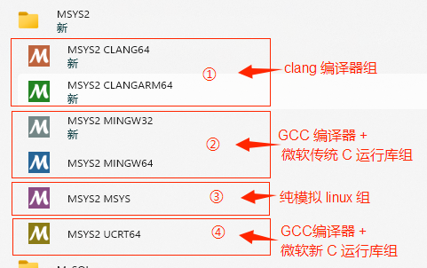

# golang

> 一般用于服务器端 server side programming
> 开发应该使用linux或mac (win不适合开发)

## setting up golang on windows

### Install Go (Golang)

https://go.dev/dl/

**.msi* *

1. 直接安装到目录: `C:\DevOps\Go\go版本号`

2. 配置代理(七牛云): 

   ```bash
   # 启用 Go Modules 功能,到v1.16版本开始Go Module默认开启
   go env -w GO111MODULE=on
   
   # 配置 GOPROXY 环境变量，以下三选一
   
   # 1. 七牛 CDN
   go env -w  GOPROXY=https://goproxy.cn,direct
   
   # 2. 阿里云
   go env -w GOPROXY=https://mirrors.aliyun.com/goproxy/,direct
   
   # 3. 官方
   go env -w  GOPROXY=https://goproxy.io,direct
   ```

   

**.zip**

1. 下载解压到目录: `C:\DevOps\Go\go版本号`

2. 配置系统环境变量: 

   1. 新建`GROOT`变量,指定更目录`C:\DevOps\Go\go版本号`
   2. 系统变量path中,添加值: `%GROOT%\bin`

3. 配置用户环境变量: 

   1. 新建`GOPATH`变量,值为: `%USERPROFILE%\go`

4. 配置代理(七牛云): 

   ```bash
   go env -w GOPROXY=https://goproxy.cn,direct
   ```

   

**配置完成测试**

1. 查看版本: go version
2. 查看配置文件: go env
3. `goland` 配置`GROOT`,开启`Go模块集成`


**目录说明**

GROOT:  为了方便计算,找到我们所安装的SDK,路径一般写到bin目录的上一级,就是go的安装路径，也是为了方便配合PATH使用

​		假如SDK的存放路径修改了只需要修改GOROOT,而不用修改GOPATH

**GOPATH: 工作目录,创建项目时指定的存放目录，go install/go get和 go的工具等会也用到GOPATH环境变量,默认在`%USERPROFILE%\go`下**

GOBIN: go语言生成可执行程序的路径,可以自己指定

```bash
一般约定的三个目录：
        bin(存放编译后的二进制文件)
        pkg(存放编译后的库文件)
        src(存放源代码文件,该目录下可以包含很多包)
其他目录：
        api(内部包含各种api，方便IDE内部的工作)
        doc:Go语言的各种文档，官网上有的，这里基本会有。
        lib：目录内包含文档模板
        misc：其他的一些工具，例如cgo等
        test：包含很多测试程序
        AUTHORS：官方 Go语言作者列表
        CONTRIBUTORS：第三方贡献者列表
        LICENSE：Go语言发布授权协议
        PATENTS：专利
        README：文件提示用户怎么操作
        VERSION：顾名思义安装的Go语言版本
```


### Install Goland

Jetbrain 激活方式汇总: https://www.lzskyline.com/index.php/archives/157/?replyTo=198

 1. 基于power插件(推荐)

    这个方法十分的简单粗暴并且快捷，激活之后就不需要找再辛苦去找注册码了，所以后续升级也都是没问题的，被zhile大神成为非对称加密的屠龙刀

    配置方法如下：

    - 下载插件包并解压到自己喜欢的位置：[点我下载](https://www.lzskyline.com/usr/uploads/2024/10/4018910141.zip): ja-netfilter.zip
    - 编辑IDEA的vmpotions，Mac的路径如下（其他系统自行百度搜位置）

    ```
    ~/Library/Application Support/JetBrains/IntelliJIdea*/idea.vmoptions
    ```

    - （有则改之，无则新建）在vmoptions文件尾增加一行

    ```
    -javaagent:/你解压后的ja-netfilter.jar文件路径
    ```

 2. 注册码激活(推荐): https://ipfs.io/ipfs/bafybeih65no5dklpqfe346wyeiak6wzemv5d7z2ya7nssdgwdz4xrmdu6i/

    下载 [jetbra.zip](https://ipfs.io/ipfs/bafybeih65no5dklpqfe346wyeiak6wzemv5d7z2ya7nssdgwdz4xrmdu6i/files/jetbra-8f6785eac5e6e7e8b20e6174dd28bb19d8da7550.zip)文件,放好位置,点击`scripts`脚本,自动配置 vmoptions

    使用页面 https://jetbra.in/5d84466e31722979266057664941a71893322460 上的密钥

    ```bash
    操作指南：
    1. 将 -javaagent:/path/to/ja-netfilter.jar=jetbrains 添加到您的 vmoptions（手动或自动）
    2. 在“许可证”窗口中注销 jb 帐户
    3. 使用页面 https://jetbra.in/5d84466e31722979266057664941a71893322460 上的密钥
    4. 插件“mymap”自 2022.1 版起已弃用
    5. 不必在意激活时间，它是一个后备许可证，不会过期
    
    享受它~
    
    JBR17：
    将这 2 行添加到您的 vmoptions 文件：（手动，没有任何空格字符）
    --add-opens=java.base/jdk.internal.org.objectweb.asm=ALL-UNNAMED
    --add-opens=java.base/jdk.internal.org.objectweb.asm.tree=ALL-UNNAMED
    
    新功能：
    自动配置 vmoptions：
    macOS 或 Linux：执行“scripts/install.sh”
    Windows：双击执行“scripts\install-current-user.vbs”（针对当前用户）
    “scripts\install-all-users.vbs”（针对所有用户）
    ```

    

3.许可证服务器: https://jcshan709.github.io/jetbrains-activating-tutorial/

关键字段搜索,查找 JetBrains 许可证服务器,找到开放了 80 端口的站点，点击查看状态码是否为**302**，如果不是，再找一个。\

启动您的 IDE 并`License Server`在激活页面上进行选择。复制地址，包括协议（`http://`）（不包括端口），然后单击`Activate`,若激活失败，请寻找其他服务器尝试。

> - fofa: header="https://account.jetbrains.com/fls-auth"
> - shodan: Location: https://account.jetbrains.com/fls-auth
> - censys: services.http.response.headers.location: account.jetbrains.com/fls-auth

## setup goland and wsl ubuntu

> ### **`cd ~`：切换到当前用户的主目录**
>
> 每个用户都有一个专属的主目录，例如：
>
> - 用户 `alice` 的主目录路径是 `/home/alice`，那么 `~` 就等同于 `/home/alice`。
> - 如果是 `root` 用户，则主目录是 `/root`，所以 `~` 表示 `/root`。
>
> ### `~/.bashrc`
>
> 是 Linux 系统中每个用户的 **Bash Shell 配置文件**，主要用于配置用户环境和命令别名等 Shell 行为。它是一个 **脚本文件**，会在用户使用 Bash 登录或启动新的非登录 Shell 时被读取和执行。
>
> ### Vim
>
> 模式切换是 Vim 的核心设计，它将光标移动、文本选择与输入分开，提供高效的编辑体验。初学者应着重掌握以下基本模式及其切换：
>
> - **普通模式**：按 `Esc` 确保进入普通模式。
> - **插入模式**：按 `i` 开始输入文本，按 `Esc` 返回普通模式。
>- **命令模式**：按 `:` 执行文件保存、退出等命令。


> ### 根目录 `/`
>
> - 系统中所有文件和目录的起点。所有其他目录都是它的子目录。
>
> `/bin` （Binary）
> 
>- 存放基本的用户可用命令和二进制可执行文件，如 `ls`、`cp`、`mv`。
> - 用户和系统均可使用。
>
> `/sbin` （System Binary）
>
> - 存放系统管理员使用的管理工具和二进制文件，如 `reboot`、`ifconfig`。
>- 一般只有管理员才能执行。
> 
>### `/boot`
> 
> - 包含引导加载程序文件，比如 Linux 内核、`grub` 配置文件。
>
> `/dev` （Device）
>
> - 包含设备文件，比如硬盘、终端设备等（如 `/dev/sda`，`/dev/tty`）。
> - 用于与系统设备交互。
>
> `/etc`
>
> - 存放系统配置文件，如网络配置文件、用户信息文件。
>- 例如：`/etc/fstab`、`/etc/passwd`。
> 
>`/home`
> 
> - 普通用户的家目录，每个用户通常有一个独立的子目录，比如 `/home/username`。
>- 用于存放用户的个人数据和配置。
> 
>`/lib` 和 `/lib64`
> 
> - 存放共享库文件和内核模块，支持 `/bin` 和 `/sbin` 中的程序运行。
>- 例如：C 语言的标准库文件。
> 
>`/media` 和 `/mnt`
> 
> - **`/media`**：挂载外部设备（如 U 盘、光盘）时的默认挂载点。
>- **`/mnt`**：临时挂载文件系统的位置。
> 
>`/opt` （Optional）
> 
> - 存放第三方软件包或自定义安装的软件，通常是手动安装的软件。
>
> `/proc`
>
> - 一个虚拟文件系统，存储内核和进程信息（如 `CPU`、内存状态）。
> - 例如：`/proc/cpuinfo`，`/proc/meminfo`。
>
> ### `/root`
>
> - **系统管理员（root 用户）的家目录，与普通用户的 `/home/username` 类似。**
>
> `/run`
>
> - 存放运行时数据，如进程 PID 文件、系统服务的临时文件。
> - 通常是临时存储。
>
> `/srv` （Service）
>
> - 存放系统提供的服务相关的数据文件，比如 Web 服务或 FTP 的数据。
>
> `/sys`
>
> - 一个虚拟文件系统，提供内核对象与用户交互的接口。
> - 用于访问和管理硬件信息。
>
> `/tmp` （Temporary）
>
> - 用于存放临时文件，系统会定期清理。
>- 例如：临时下载、会话数据等。
> 
>### `/usr` （Unix System Resources）
> 
> - 存放用户级别的应用程序和文件。
>  - **`/usr/bin`**：一般用户的可执行文件。
>   - **`/usr/sbin`**：管理员的可执行文件。
>  - **`/usr/lib`**：共享库。
>   - **`/usr/share`**：共享的文档和资源文件。
> 
>`/var` （Variable）
> 
>- 存放经常变化的数据文件。
>   - **`/var/log`**：日志文件。
>   - **`/var/spool`**：邮件队列、打印队列等。
> 
> 

教程: https://www.jetbrains.com/help/go/how-to-use-wsl-development-environment-in-product.html#wsl-general

**将 WSL 环境用于项目**: 您可以 在 Windows 上本地创建或打开您的项目，然后使用运行目标在 WSL 中运行已编译的代码。这可能对跨平台开发有帮助。

卸载golang

apt管理的

```bash
sudo apt remove golang # 卸载软件包
sudo apt purge golang # 完全卸载软件包（包括配置文件）
sudo apt autoremove # 清理无用的依赖包
```

wget下载的

```bash
sudo rm -rf /usr/local/go # 移除指定位置的go文件夹
```


1. 在`ubuntu`安装golang环境

   下载

   ```bash
   wget https://go.dev/dl/go1.23.4.linux-amd64.tar.gz
   ```

   解压到 `/usr/local` 目录

   ```bash
   sudo tar -C /usr/local -xzf go1.23.4.linux-amd64.tar.gz
   ```

   **配置环境变量**： 将 Go 添加到 `PATH` 中，在 `~/.bashrc` 或 `~/.zshrc` 中添加以下行

   ```bash
   echo "export PATH=\$PATH:/usr/local/go/bin" >> ~/.bashrc
   ```

   加载配置文件

   ```bash
   source ~/.bashrc
   ```

2. 配置goland

   Run/Debug Configurations -> Run on -> Create New Targets (或者Manage targets 自定义配置) -> wsl

3. 按需切换编译运行环境即可

## Tutorial

> https://golang.halfiisland.com/

下面对本站的内容进行一个简单的介绍，以便各位可以按需阅读，部分页面是空白的代表着还未更新。

- 语言入门：主要讲解关于 Go 语言本身的内容，偏理论。
  - [语法基础](https://golang.halfiisland.com/essential/base/)：主要讲一些十分基础的语法，像是`if`，`for`之类的语法规则。
  - [语法进阶](https://golang.halfiisland.com/essential/senior/)：讲一些 Go 独有的东西，关于模块，测试，协程等相关内容。
  - [标准库](https://golang.halfiisland.com/essential/std/)：对 Go 自带的标准库的一个简单介绍，因为标准库的内容实在太过庞大所以随缘更新。
  - [实现原理](https://golang.halfiisland.com/essential/impl/)：主要讲 Go 语言的一些内部设计原理，比如协程调度，内存管理，垃圾回收等。
- 社区生态：主要讲解 Go 周边的生态，偏应用。
  - [数据库](https://golang.halfiisland.com/community/database/)：通过 Go 操作主流的数据库。
  - [微服务](https://golang.halfiisland.com/community/micro/)：介绍一些与 Go 有关的微服务工具。
  - [第三方库](https://golang.halfiisland.com/community/pkgs/)：介绍一些由 Go 编写的第三方库，随缘更新，也可以直接在[依赖导航](https://golang.halfiisland.com/deb.html)里面查看。

### 字符串拼接

```go
func main() {
   builder := strings.Builder{}
   builder.WriteString("this is a string ")
   builder.WriteString("that is a int")
   fmt.Println(builder.String())
}
```

### Golang泛型

> 如果你经常要分别为不同的类型写完全相同逻辑的代码，那么使用泛型将是最合适的选择
> 参考: https://www.cnblogs.com/insipid/p/17772581.html

`T` 就是上面介绍过的**类型形参(Type parameter)**，在定义Slice类型的时候 T 代表的具体类型并不确定，**类似一个占位符**


观察下面这个简单的例子：

```go
type IntSlice []int

var a IntSlice = []int{1, 2, 3} // 正确
var b IntSlice = []float32{1.0, 2.0, 3.0} // ✗ 错误，因为IntSlice的底层类型是[]int，浮点类型的切片无法赋值
```

这里定义了一个新的类型 `IntSlice` ，它的底层类型是 `[]int` ，理所当然只有int类型的切片能赋值给 `IntSlice` 类型的变量。

接下来如果我们想要定义一个可以容纳 `float32` 或 `string` 等其他类型的切片的话该怎么办？很简单，给每种类型都定义个新类型：

```go
type StringSlice []string
type Float32Slie []float32
type Float64Slice []float64
```

但是这样做的问题显而易见，它们结构都是一样的只是成员类型不同就需要重新定义这么多新类型。那么有没有一个办法能只定义一个类型就能代表上面这所有的类型呢？答案是可以的，这时候就需要用到泛型了：

```go
type Slice[T int|float32|float64 ] []T
```

不同于一般的类型定义，这里类型名称 Slice 后带了中括号，对各个部分做一个解说就是：

-`T` 就是上面介绍过的**类型形参(Type parameter)**，在定义Slice类型的时候 T 代表的具体类型并不确定，类似一个占位符

- `int|float32|float64` 这部分被称为**类型约束(Type constraint)**，中间的 `|` 的意思是告诉编译器，类型形参 T 只可以接收 int 或 float32 或 float64 这三种类型的实参
- 中括号里的 `T int|float32|float64` 这一整串因为定义了所有的类型形参(在这个例子里只有一个类型形参T），所以我们称其为 **类型形参列表(type parameter list)**
- 这里新定义的类型名称叫 `Slice[T]`

这种类型定义的方式中带了类型形参，很明显和普通的类型定义非常不一样，所以我们将这种

> 类型定义中带 **类型形参 的类型，称之为**泛型类型(Generic type)

泛型类型不能直接拿来使用，必须传入`类型实参(Type argument)` 将其确定为具体的类型之后才可使用。而传入类型实参确定具体类型的操作被称为 `实例化(Instantiations) ：`


简单的映射和过滤

```go
func MapAnything(input []any, mapper func(any) any) []any {
    result := make([]any, len(input))
    for i, v := range input {
       result[i] = mapper(v)
    }
    return result
}
func FilterAnything(input []any, pred func(any) bool) []any {
    var result []any
    for _, v := range input {
       if pred(v) {
          result = append(result, v)
       }
    }
    return result
}
```


## application

### new project steps:

1. 新建`github`远程仓库
2. 本地`git clone URL`
3. open folder as goland project

### Bash Script and Tools

### Golang for Embedded Systems

### Server side programming

### Website

### restful api

> https://springdoc.cn/go-for-java-springboot-developers/

本文将会使用到以下库来在 Go 中构建一个 REST API：

- [Gin Web Framework](https://gin-gonic.com/) - Web 框架
- [Viper](https://github.com/spf13/viper) - 配置库
- [zap](https://github.com/uber-go/zap) - 日志库
- [pgx](https://github.com/jackc/pgx) - Go 的 PostgreSQL 驱动程序和工具包
- [golang-migrate](https://github.com/golang-migrate/migrate) - 数据迁移

### Golang app

fyne: https://github.com/fyne-io/fyne

Fyne 是一款出色的产品。但与 JS 框架或 Qt 等相比，它的 UI 功能相当简单。但如果它符合您的要求，那么绝对值得推荐。

fyne 绝对是一个不错的选择！如果您想要高度定制的 UI 外观，那么使用 Web 框架和 Wails 可能更好。但如果您只需要标准 UI 组件（按钮、选项卡、图像、文本输入等）以及一种布局它们以构建表单、列表、对话框等的方法，那么 Fyne 就很棒。无需学习 Web 前端生态系统对我来说是一个巨大的优势，但如果你已经拥有 React 经验等，这可能就不那么重要了。


## fyne

> app (应用) -> window (窗口) -> widget (组件) -> content (内容)
>
> 新建-> 配置 -> 使用

### Get started

https://docs.fyne.io/started/

Fyne 需要 3 个基本元素，Go 工具（至少为 1.12 版）、C 编译器（用于连接系统图形驱动程序）和系统图形驱动程序。

**MSYS2** 

> **MSYS2**是一组工具和库，为您提供一个易于使用的环境来构建、安装和运行原生 Windows 软件。
>
> 理解为 linux容器
>
> 1. 成熟，有很多工业应用使用它作为开发环境，大家学了不会白学（mingw64-gcc 也成熟）；
> 2. 编译出来的程序可以 纯 Windows 环境运行；
> 3. 和真正的 Linux 一样，自带包管理器，方便我们在 C/C++ 程序中，使用大量的C/C++成熟、强大的开发包，无需我们手工编译



MSYS2 平台是推荐在 Windows 上使用的方法。操作如下：

1. [从msys2.org](https://www.msys2.org/)安装 MSYS2

2. 安装后，请勿使用打开的 MSYS 终端

3. 从开始菜单打开“MSYS2 MinGW 64位”

4. 执行以下命令（如果询问安装选项，请确保选择“全部”）：

   **mingw-w64-x86_64-go 为可选**

   ```bash
    $ pacman -Syu
    $ pacman -S  mingw-w64-x86_64-toolchain mingw-w64-x86_64-go
   ```

5. 如果第4步选择了 mingw-w64-x86_64-go ,您需要将 ~/Go/bin 添加到您的 $PATH，对于 MSYS2，您可以将以下命令粘贴到您的终端中：

   ```bash
   $ echo "export PATH=\$PATH:~/Go/bin" >> ~/.bashrc
   ```

6. 为了使编译器在其他终端上运行，您需要设置 Windows %PATH% 变量来查找这些工具。转到“编辑系统环境变量”控制面板，点击“高级”，然后将“C:\msys64\mingw64\bin”添加到路径列表中。

**golang**

从 Go 1.16 开始，您需要先设置模块才能使用该包

运行以下命令并替换`MODULE_NAME`为您喜欢的模块名称（这应该在特定于您的应用程序的新文件夹中调用）。

```bash
$ mkdir myapp
$ cd myapp
$ go mod init MODULE_NAME
```

现在您需要下载 Fyne 模块和辅助工具。这将使用以下命令完成

```bash
$ go get fyne.io/fyne/v2@latest
$ go install fyne.io/fyne/v2/cmd/fyne@latest
```

### first app

> app -> window -> widget set

```go
package main

import (
	"fyne.io/fyne/v2/app"
	"fyne.io/fyne/v2/widget"
)

func main() {
	a := app.New()
	w := a.NewWindow("Hello World")

	w.SetContent(widget.NewLabel("Hello World!"))
	w.ShowAndRun()
}
```

### Run Fyne Demo( Fyne 工具包)

直接运行`demo app`

```bash
go run fyne.io/fyne/v2/cmd/fyne_demo@latest
```

安装Fyne 工具包到本地

```bash
go install fyne.io/fyne/v2/cmd/fyne@latest
```

工具使用: 打包`demo app` (**提示缺少git,待解决  MSYS安装?**)

```bash
fyne get fyne.io/fyne/v2/cmd/fyne_demo
```

### RunLoop

要使 GUI 应用程序正常工作，它需要运行事件循环（有时称为运行循环）来处理用户交互和绘制事件。在 Fyne 中，这是使用`App.Run()` 或`Window.ShowAndRun()`函数启动的。其中一个必须在函数中的设置代码末尾调用`main()`。

一个应用程序只能有一个运行循环，因此您只能`Run()`在代码中调用一次。第二次调用将导致错误。

```go
func main() {
	myApp := app.New()
	myWindow := myApp.NewWindow("Hello")
	myWindow.SetContent(widget.NewLabel("Hello"))

	myWindow.Show()
	myApp.Run()
	tidyUp()
}

func tidyUp() {
	fmt.Println("Exited")
}
```

对于桌面运行时，可以通过调用直接退出应用程序（移动应用程序不支持此功能） - 开发人员代码中通常不需要。一旦所有窗口都关闭，应用程序也会退出。另请参阅，在应用程序退出之前，不会调用`App.Quit()` 之后执行的函数。`Run()`

### 更新GUI内容


